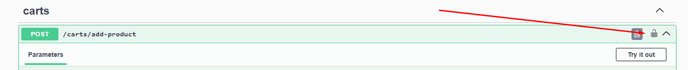
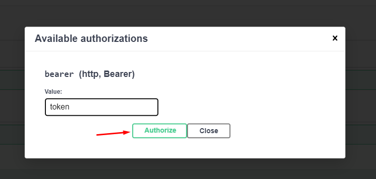

## Pre-requisitos para rodar a aplicação localmente
- Docker
- Node.js ([20.11.1](https://nodejs.org/dist/v20.11.1/)) - _Certifique-se de usar a versão especificada, o [nvm](https://github.com/coreybutler/nvm-windows) pode ser usado para isso_
- PM2 (`npm install -g pm2@latest`)
- Make - _Pode ser instalado com `brew install make` (MacOS), `choco install make` (Windows), `sudo apt-get install make` (Linux) ou fazendo o download pelo browser através do [site](https://ftp.gnu.org/gnu/make/)_

## Como rodar os microsserviços
__Instrução antecipada:__ Para receber e-mails ao finalizar uma compra é preciso preencher as variáveis ambiente do arquivo `/notifications-service/envs/.env.development` referente ao SMTP

1. Execute o comando `docker-compose up -d` (Aguarde os containers iniciarem)
2. Execute o comando `make build-all` para instalar as dependências e compilar os microsserviços. _(Este procedimento pode demorar um pouco, se estiver em um computador mais performático execute o comando com a flag `-j7`, ou seja: `make build-all -j7` para instalar as dependências simultaneamente para todos os microsserviços)_
3. Por fim, é só executar com o comando `make run-all`

Os serviços deverão rodar nos seguintes hosts:
- Products Service: http://localhost:3000/swagger-ui
- Accounts Service: http://localhost:3001/swagger-ui
- Carts Service: http://localhost:3002/swagger-ui
- Orders Service: http://localhost:3003/swagger-ui
- Payments Service: http://localhost:3004/swagger-ui
- Notifications Service: http://localhost:3005/swagger-ui
- E-Commerce BFF: http://localhost:3006/swagger-ui

## Roteiro de uso
1. Primeiro, crie uma conta através do micro-serviço de [_accounts_](http://localhost:3001/swagger-ui) na rota `POST /accounts`
2. No mesmo micro-serviço, faça login a partir da rota `POST /auth`
3. No micro-serviço [ecommerce-bff](http://localhost:3006/swagger-ui), use o token obtido no login para adicionar ou remover produtos do carrinho e finalizar uma compra a partir da rota `POST /orders` (_Abaixo há instruções de como fazer login pelo Swagger) (Use os IDs dos produtos abaixo que já vem pre-cadastrados no banco_)

4. Ao finalizar uma compra você deverá receber um e-mail que informa o resultado do pagamento da compra. (_O resultado é uma de chance 50% de falhar / 50% de aprovar_)

__Como fazer login via Swagger__



__Obs:__ Para receber o e-mail, é preciso seguir as instruções acima sobre preencher as variáveis ambiente referente ao SMTP. 
## Produtos já cadastrados na catalogo
```typescript
[
    { 
        id: "0bcd50b3-95bb-45e2-bc4a-4ad1e9dcc5fe",
        title: "Nintendo Switch OLED",
        description: "Nintendo Switch OLED Completo com Joy-Con",
        price: 219990,
        formattedPrice: "R$ 2.199,90"
    },
    { 
        id: "51046043-6b3d-47e0-b5b0-f80b6027b0e3",
        title: "Playstation 4",
        description: "Playstation 4 Standard",
        price: 239990,
        formattedPrice: "R$ 2.399,90"
    },
    { 
        id: "75795588-494f-4b6a-a24c-5aabed80dac3",
        title: "Playstation 4 Slim",
        description: "Playstation 4 Slim Completo",
        price: 259990,
        formattedPrice: "R$ 2.599,90"
    },
    { 
        id: "45646da7-b747-49e5-a167-91a45d5a0d5b",
        title: "Playstation 5",
        description: "Playstation 5 Standard Edition",
        price: 379990,
        formattedPrice: "R$ 3.799,90"
    },
    { 
        id: "93847885-811a-4688-9db3-3975447d41a7",
        title: "Dualsense Controller",
        description: "Dualsense Controller for PS5",
        price: 43990,
        formattedPrice: "R$ 439,90"
    },
    { 
        id: "282191e1-4d80-4de1-8a2b-4327f0a3640f",
        title: "God of War Ragnarok PS5",
        description: "God of War Ragnarok PS5 Version",
        price: 35990,
        formattedPrice: "R$ 359,90"
    },
    { 
        id: "f9f9ad24-a216-435d-b585-8db9cde35410",
        title: "The Legend of Zelda Tears of Kingdom - Nintendo Switch",
        description: "The Legend of Zelda Tears of Kingdom - Nintendo Switch",
        price: 32990,
        formattedPrice: "R$ 329,90"
    },
    { 
        id: "06b66f46-39da-4d64-badd-871b5f46c5c4",
        title: "Joycon Controller Nintendo Switch",
        description: "Joycon Controller for Nintendo Switch",
        price: 15990,
        formattedPrice: "R$ 159,90"
    },
    { 
        id: "7f0bcaf1-3c49-4a56-aa90-6227007dd478",
        title: "Xbox Series X",
        description: "Xbox Series X",
        price: 385099,
        formattedPrice: "R$ 3.850,99"
    },
]
```